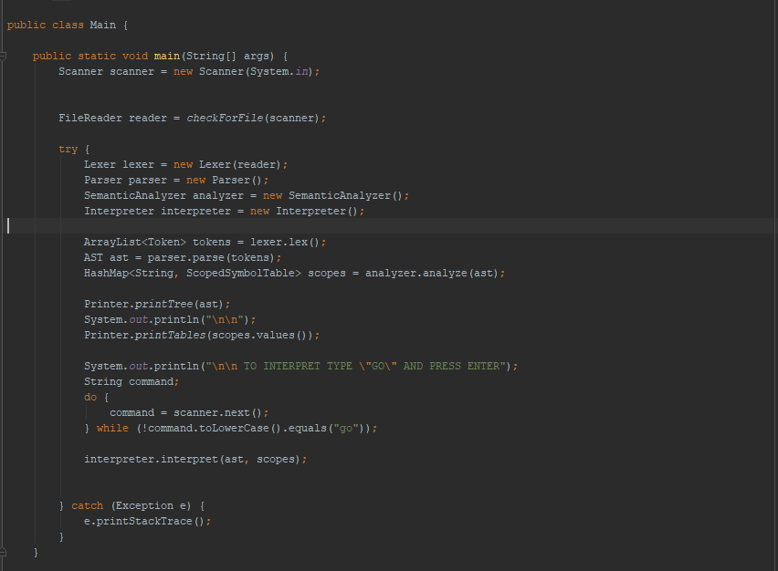
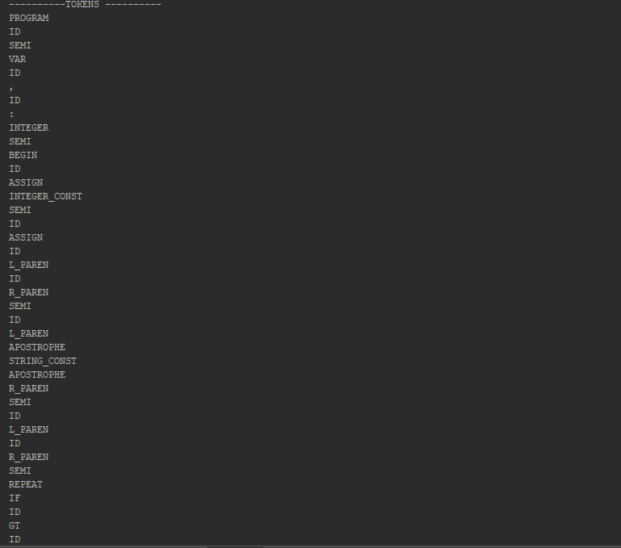
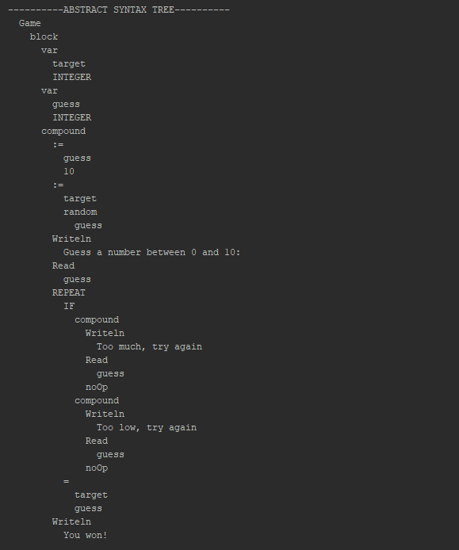
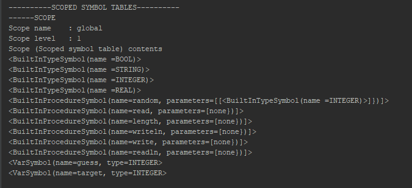
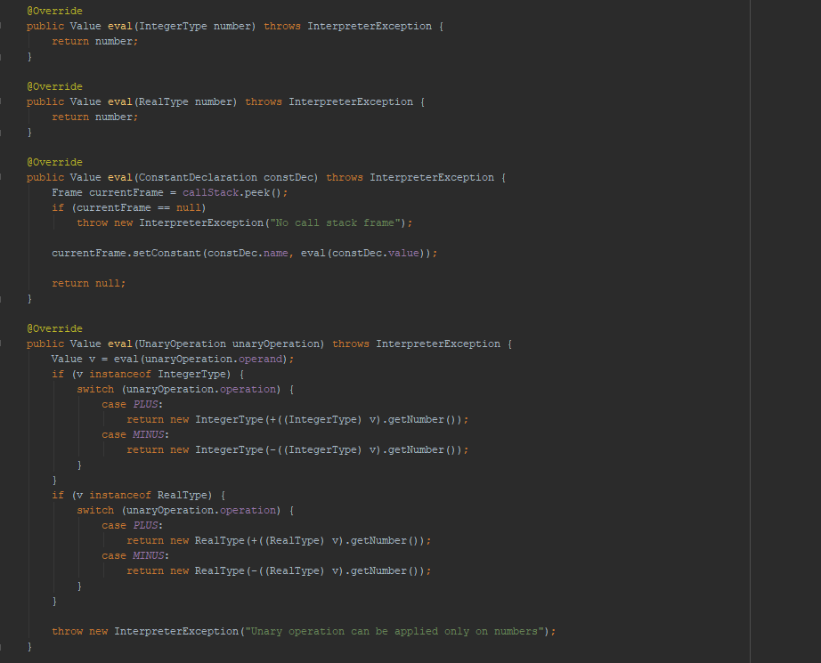

### JavaPascalInterpreter

A simple yet very flexible Java interpreter for Pascal. The project is created WITHOUT lexer parser generators like ANTLR.

I created it for one of my classes called Methods of Translation as a course project, but due to its flexibility i extended it a little bit.

### Implementations

* standard types (integer, double, boolean, string)
* arithmetic expressions
* function calls
* procedure calls
* recursion
* loops (for, repeat until, while)
* logical conditions (if)
* standard Pascal functions (writeln, write, readln, read, random)
* one-dimensional arrays
* variables
* constants
* function declarations
* procedure declarations
* scopes

There are some example programs in examples folder written in Pascal in order to test and try.

### How It Works
The interpreter is divided into several parts

# Lexer
The lexer analyzes the input and generates list of tokens. If a word isnt recognized it throws LexerException

# Parser
The parser gets the lists of tokens and tries to generate Syntax Tree based on the grammar.

If the grammar rule is not recognized it throws Parser Exception.
# Semanthic analyzer
The semanthic analyzer gets the syntax tree and generates scoped tables with variables, constants, types, procedures and functions declared in the scopes. It throws exceptions if there is duplicate names etc...

# Interpreter
The interpreter gets all the data from the previous systems and tries to interpret the syntax tree with java methods and functions.

### How to
Open the project in your preffered IDE( Eclipse, IntelliJ, others...) and run the Main.class file

### License
This project is licensed under the MIT License - see the [LICENSE](LICENSE) file for details
